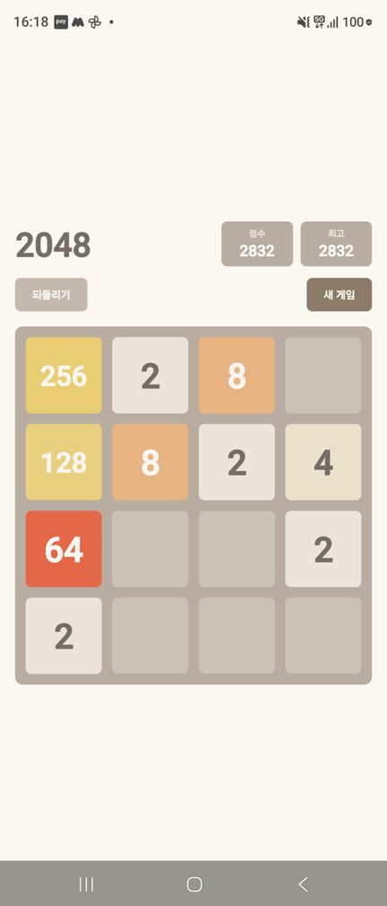

# 2048

React Native(Expo)로 만든 2048. Google Play 출시용.

<p align="center">
  
</p>

광고 없음 · 과금 없음 · 네트워크 없음 · 수집하는 데이터 없음.

## 기능

- 4×4 격자, 스와이프 병합, 점수
- 타일 이동·생성·병합 애니메이션 (병합 시 뒤 타일이 앞 타일 자리로 미끄러진 뒤 값이 바뀌며 튕긴다)
- 최고 점수 저장, 앱을 껐다 켜도 진행 중이던 판 복원
- 되돌리기 1회
- 화면 어디서든 스와이프

## 기술 선택

| | 선택 | 이유 |
| --- | --- | --- |
| 프레임워크 | Expo SDK 57 | `expo prebuild` + 로컬 gradle. 계정·클라우드 빌드 없이 끝난다 |
| 게임 로직 | 순수 TypeScript (`src/game/board.ts`) | RN에 의존하지 않아 `node --test`만으로 검증 |
| 애니메이션 | RN 내장 `Animated` | 타일 16개 transform엔 충분. Reanimated는 쓸 자리가 없다 |
| 제스처 | RN 내장 `PanResponder` | 손 뗀 시점 dx/dy 비교 한 줄 |
| 영속화 | `@react-native-async-storage/async-storage` | **유일한 추가 의존성** |
| 테스트 | Node 24 내장 test runner | 테스트 프레임워크 미설치 |

타일을 격자 배열이 아니라 **id를 가진 객체 배열**로 다루는 것이 설계의 핵심이다. id가 있어야 화면이 "어느 타일이 어디로 갔는지" 알아 이동 애니메이션을 그릴 수 있다.

## 실행

```bash
npm install
npx tsc --noEmit          # 타입 검사
node --test               # 테스트 39건
npx expo run:android      # 연결된 기기에 디버그 빌드 설치
```

출시용 AAB:

```bash
cd android && ./gradlew :app:bundleRelease
```

서명 설정은 `~/.gradle/gradle.properties`(저장소 밖)의 `GAME2048_UPLOAD_*` 프로퍼티를 읽는다. 없으면 debug 키로 서명된다.

## 구조

```
App.tsx                      상태(useState), 저장 연동, 화면 조립
src/game/board.ts            게임 규칙 — newGame · move · isGameOver
src/game/board.test.ts       규칙 검증 (node --test)
src/game/colors.ts           타일 값 → 색상
src/storage-parse.ts         저장 데이터 파싱·검증 (RN 의존성 없음)
src/storage.ts               AsyncStorage 래퍼
src/components/Board.tsx     격자 배경 + 타일 배치
src/components/Tile.tsx      타일 1개, 이동·팝 애니메이션
src/components/Header.tsx    점수 · 최고 점수 · 되돌리기 · 새 게임
src/components/useSwipe.ts   스와이프 → 방향
android/                     네이티브 프로젝트 (커밋함 — 서명 설정이 여기 산다)
docs/                        설계 · 계획 · 작업 이력
```

## 문서

- [설계](docs/superpowers/specs/2026-09-22-2048-design.md) — 무엇을 왜 만드는가
- [구현 계획](docs/superpowers/plans/2026-09-22-2048.md) — 태스크별 코드와 검증
- [작업 이력](docs/worklog/done/) — 실측·결정·함정

## 라이선스

MIT
